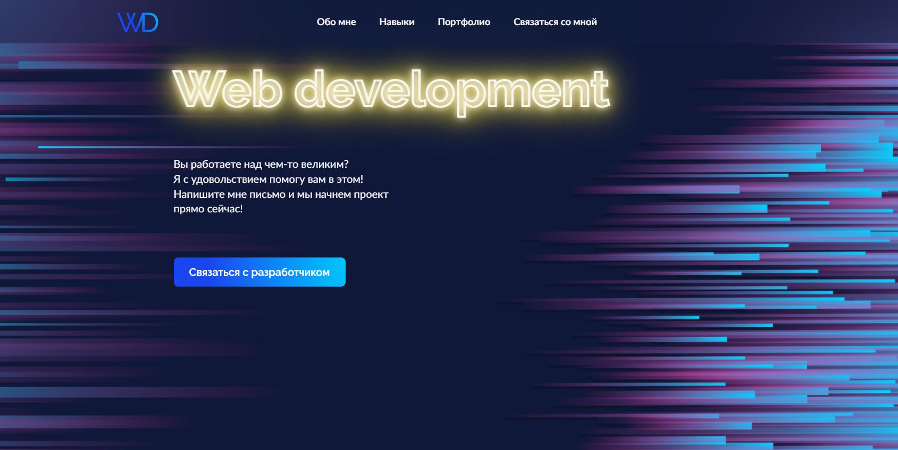

### Portfolio-app
### Сайт-портфолио

---

🌐GitHubPages ➡️➡️➡️ https://next-portfolio-a7hd.vercel.app/#hero

---

### 💻 Используемые технологии:

1. ReactJS 18
2. NextJS
3. TypeScript
4. Redux Toolkit (хранение данных / пицц)
5. React Router v6 (навигация)
6. Axios + Fetch (отправка запроса на бэкенд)
7. React Hooks (хуки)
8. Prettier (форматирование кода)
9. CSS-Modules / SCSS (стилизация)
10. React Content Loader (скелетон)
11. React Pagination (пагинация)
12. Lodash.Debounce
13. Code Splitting, React Loadable, useWhyDidYouUpdate
14. Vercel

---

